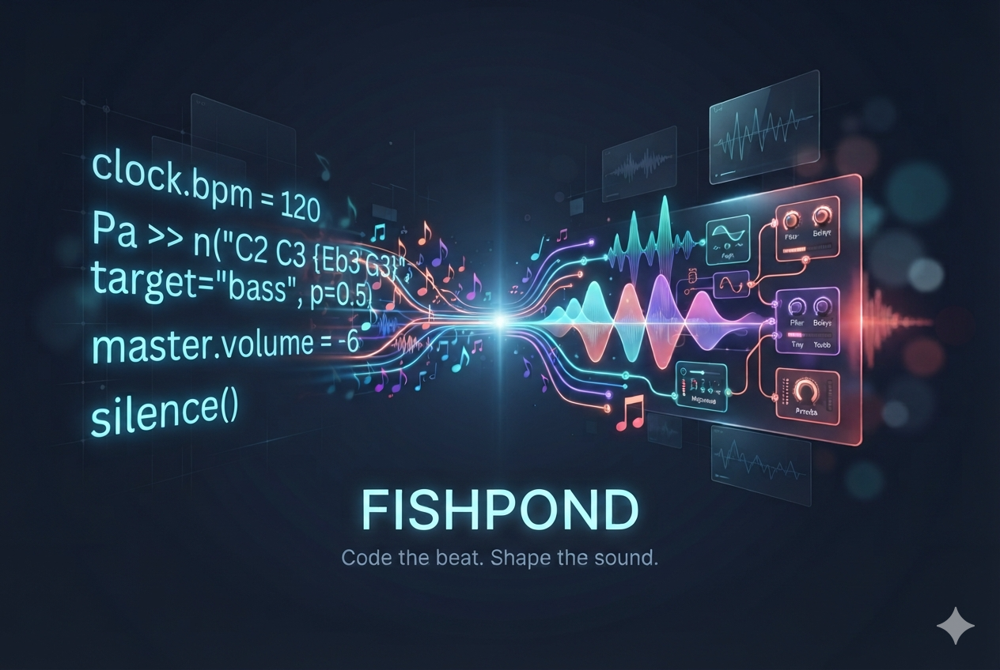

# Fishpond



Fishpond is a live-coding digital audio workstation for making music with
Python. Write a pattern, evaluate it while audio is running, and hear your
change immediately.

Fishpond is for musicians who want the spontaneity of live coding with the
sound palette of their own instrument plugins. It uses a Python workflow
inspired by Sardine and routes notes directly to VST3 instruments. Fishpond
does not depend on SuperCollider and does not include a built-in synthesizer.

## Platform status

Fishpond has currently been tested and released on **macOS** only.

[Download the macOS preview from GitHub Releases](https://github.com/whatevergeek/fishpond/releases).
The release includes the CPython 3.12 runtime, so users do not need to install
Python separately.

Linux and Windows are not yet validated or distributed as releases. Users on
those platforms can build from source, but must test the application, audio
device, and VST3 workflow in their own environment.

## Before you start

Fishpond requires a compatible VST3 instrument to make sound. It does not
bundle or redistribute third-party plugins. Free instruments you can try
include:

- [Surge XT](https://surge-synthesizer.github.io/) — an open-source synthesizer.
- [Vital](https://vital.audio/) — a wavetable synthesizer with a free version.

Install the VST3 version from the plugin developer. Check the plugin's own
license and system requirements.

## Make your first sound

1. Download and unzip the macOS preview, then move `Fishpond.app` to
   Applications.
2. If macOS blocks the unsigned preview, right-click the app, choose **Open**,
   and confirm.
3. Install a VST3 instrument such as Surge XT or Vital.
4. Open Fishpond and select the **Instruments** tab.
5. Load the installed VST3 into **Instrument 01**.
6. Start the audio engine and open the **Live Coding** tab.
7. Paste this code into the editor:

```python
clock.bpm = 120
Pa >> n("C2 C3 {Eb3 G3}", target="instrument_01", p=0.5, dur=0.25)
```

8. Place the cursor on the code and press **Shift+Return**.

`instrument_01` is the live-code target for the first instrument slot. The
braced notes play together as a chord. `p` controls the pattern period in
beats, and `dur` controls note duration.

## Live-coding basics

Fishpond evaluates code in a persistent Python session. Named players and clock
state survive later evaluations. Assigning a new pattern to the same player
replaces its previous pattern instead of creating a duplicate.

```python
# Set the shared musical clock.
clock.bpm = 96

# A sequence advances through the notes; braces play a chord together.
Pa >> n("C2 C3 {Eb3 G3}", target="instrument_01", p=0.5, dur=0.25)

# Run another independent player on another instrument slot.
Pb >> n("C4 E4 G4", target="instrument_02", p=1, dur=0.5)

# Stop one player, all players, or all pending instrument events.
silence(Pa)
silence()
panic()

# Set the final stereo mix level in dB.
master.volume = -12
```

Pattern strings support note sequences, rests (`.`), and chord groups such as
`{C3 E3 G3}`. Fishpond reports invalid targets and malformed values as
diagnostics instead of silently sending invalid events.

### Editor controls

- **Shift+Return** evaluates the current line or selected lines.
- The evaluated line range flashes briefly so you can see what ran.
- Python `print()` output appears in the Console pane.
- **View > Clear Output** clears the Console (`Cmd+K` on macOS;
  `Ctrl+K` on Windows/Linux).
- **File > New**, **Open**, **Save**, and **Save As** manage `.fp` files.
- **View > Enter Full Screen** provides a focused performance workspace.
- The master-volume fader ranges from `-60 dB` to `0 dB`; double-click resets
  it to unity gain.

## What is included in the macOS preview

- Embedded CPython 3.12 runtime.
- Four independently routed VST3 instrument slots.
- Sardine-style named players and pattern strings.
- Note names, rests, polyphonic chord groups, and quantised replacement.
- Code-driven tempo and master volume.
- Syntax-coloured editor feedback and captured Python output.
- Safe player stop and global panic controls.
- Asynchronous VST3 loading and replacement while audio continues.
- Saving and loading Live Coding text as `.fp` files.

## Current limitations

- The macOS preview is unsigned and not Apple-notarized. macOS may require
  **Right-click > Open** on first launch.
- `.fp` files save Live Coding text only. Plugin state, transport state, plugin
  selections, effects, parameter automation, and the plugin catalogue are not
  persisted yet.
- The current release uses controlled VST3 loading rather than a full searchable
  plugin catalogue.
- Audio Units, Linux, and Windows have not been validated for this release.
- Fishpond does not bundle or redistribute third-party instruments.

## Troubleshooting

### The app opens but I hear no sound

Confirm that a VST3 instrument is installed, loaded into an instrument slot,
and ready before evaluating the code. Confirm that Fishpond has an active audio
device and that the target matches the slot, such as `instrument_01`.

### macOS says the app cannot be opened

This preview is not notarized. Right-click `Fishpond.app`, choose **Open**, and
confirm the prompt. Only download the app from the Fishpond GitHub repository.

### The code reports an unknown target

The target must identify a ready instrument slot. Start with
`target="instrument_01"` after loading a plugin into Instrument 01.

### How do I stop everything?

Evaluate `panic()` or use Fishpond's global panic control. Use `silence()` when
you want to stop active players while keeping the instrument state available.

## Building from source

Source builds are intended for contributors and for users on platforms without
a released binary. The current application build requires:

- CMake 3.25 or newer.
- A C++17 compiler.
- JUCE 8.0.13.
- CPython 3.12.13 development headers and framework files.
- A supported VST3 instrument for real-plugin testing.

On macOS, install the developer Python dependency and build the application:

```sh
brew install python@3.12
cmake --preset app-macos -DFISHPOND_FETCH_JUCE=ON
cmake --build --preset app-macos --target FishpondApp
open build/app-macos/app/FishpondApp_artefacts/Debug/Fishpond.app
```

The JUCE fetch requires network access. See [the build guide](docs/build.md)
for pinned dependencies, platform presets, licensing, and troubleshooting.

Linux and Windows build presets exist, but those platforms are experimental
and have not been validated as user releases. Anyone building there should
test the complete application and plugin workflow before relying on it.

## Testing

The project includes deterministic unit, runtime, integration, and JUCE fixture
tests covering clock semantics, player replacement, pattern parsing, channel
routing, target validation, event queues, panic behavior, volume control, and
error handling.

Run the development contract on macOS with:

```sh
cmake --preset dev-macos
cmake --build --preset dev-macos
ctest --preset p0-build-contract-macos
```

For the real JUCE VST3 fixture:

```sh
cmake --preset juce-fixture-macos
cmake --build --preset juce-fixture-macos --target FishpondFixtureInstrument_VST3
```

## For contributors

Fishpond is a native JUCE/C++ application with an embedded CPython runtime.
Python evaluation, UI work, plugin creation, and file operations stay off the
real-time audio callback. Musical events cross into the audio engine through
bounded handoff structures, and plugin failures are surfaced as recoverable
diagnostics.

The project uses a specification-driven workflow. Requirements, technical
decisions, traceability IDs, deterministic fixtures, and manual performance
checks are maintained in the companion
[`fishpond-sdd`](../fishpond-sdd) repository.

Release maintainers can package a macOS preview from a completed release build
with:

```sh
bash scripts/package_macos_release.sh /path/to/release-build 0.1.0
```

The script bundles CPython 3.12 into the application and creates a macOS zip.

## License

Fishpond is intended for distribution under **AGPL-3.0-or-later**. JUCE is
used under its AGPLv3 option. See [the build guide](docs/build.md) for the
dependency and licensing details.
